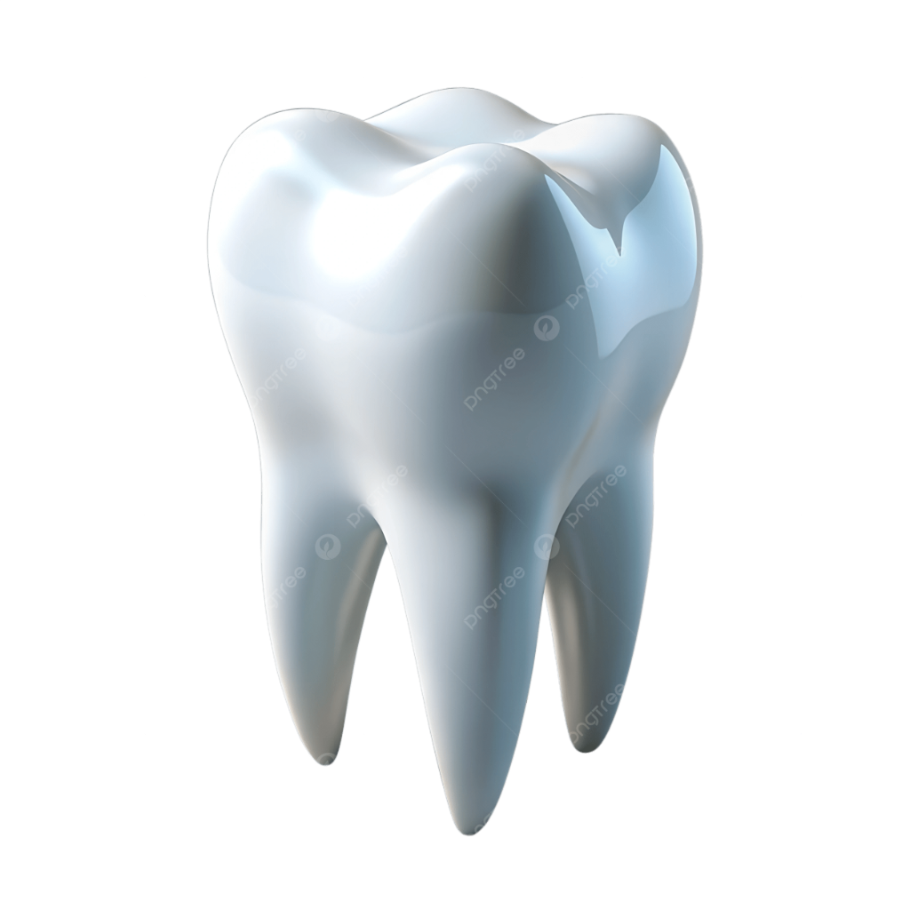

<div align="center">
  
  <h1 align="center">
    <span style="color: #0ea5e9;">Premium</span> 
    <span style="color: #3b82f6;">Dentist</span> 
    <span style="color: #8b5cf6;">Experience</span> 
    🦷✨
  </h1>
  <p align="center">
    A next-generation dental clinic web application powered by <strong>Next.js</strong>, <strong>Three.js</strong>, and <strong>Tailwind CSS</strong>.
  </p>
  
  <p align="center">
    
    
    
    
  </p>
</div>

<hr />

## 🌟 Features

Our platform brings a highly professional and colorful user experience, designed specifically for modern dental practices.

- 🦷 **Interactive 3D Hero Scene:** Engage users immediately with a realistic, interactive 3D tooth model powered by React Three Fiber.
- ✨ **Vibrant & Smooth Animations:** Leveraging Framer Motion and GSAP for micro-interactions, text reveals, and seamless page transitions.
- 📱 **Fully Responsive UI:** Built with Tailwind CSS, ensuring a flawless layout across all devices and screen sizes.
- ⚡ **Blazing Fast Performance:** Utilizes Next.js App Router for optimal Server-Side Rendering (SSR) and Static Site Generation (SSG).
- 🎨 **Dark / Light Mode Support:** Beautifully curated color palettes for both bright and dark aesthetics.
- 📅 **Integrated Booking System:** Easy-to-use interfaces for patients to schedule their appointments.

## 🚀 How It Works

This application is architected around the modern **Next.js App Router**. It separates concerns beautifully:
1. **The 3D Canvas:** The hero section mounts a Three.js canvas that renders a procedural, highly-realistic tooth. It tracks mouse movements to create a parallax/interactive effect.
2. **Animation Engine:** Scroll-based animations and layout reveals are handled seamlessly by a combination of `lenis` for smooth scrolling and `framer-motion` for element orchestration.
3. **Component Architecture:** We use atomic design principles for our UI components (`Button`, `Card`, `Accordion`), ensuring reusability and a consistent aesthetic.

## 💻 Installation Guide

Ready to run this on your local machine? Follow these simple steps:

### Prerequisites
Make sure you have [Node.js](https://nodejs.org/) (v18.17+) and npm, yarn, or pnpm installed.

### Steps

1. **Clone the repository:**
   ```bash
   git clone https://github.com/Parthparthu/dentist.git
   cd dentist
   ```

2. **Install Dependencies:**
   ```bash
   npm install
   # or
   yarn install
   # or
   pnpm install
   ```

3. **Start the Development Server:**
   ```bash
   npm run dev
   ```

4. **Experience the Magic:**
   Open your browser and navigate to `http://localhost:3000`.

## 📖 Usage Guide

- **Customizing the Clinic Details:** 
  Edit the `src/config/clinic.ts` file to quickly change the clinic's name, contact info, working hours, and social links.
- **Modifying the 3D Scene:** 
  The 3D magic happens in `src/components/3d/HeroScene.tsx`. You can tweak the lighting, material properties, and geometry calculations to change the appearance of the 3D elements.
- **Adding New Pages:** 
  Simply create a new folder under `src/app/` (e.g., `src/app/services`) and add a `page.tsx` file to create a new route.

<hr />
<div align="center">
  <p>Crafted with ❤️ for the Future of Dental Care.</p>
</div>
